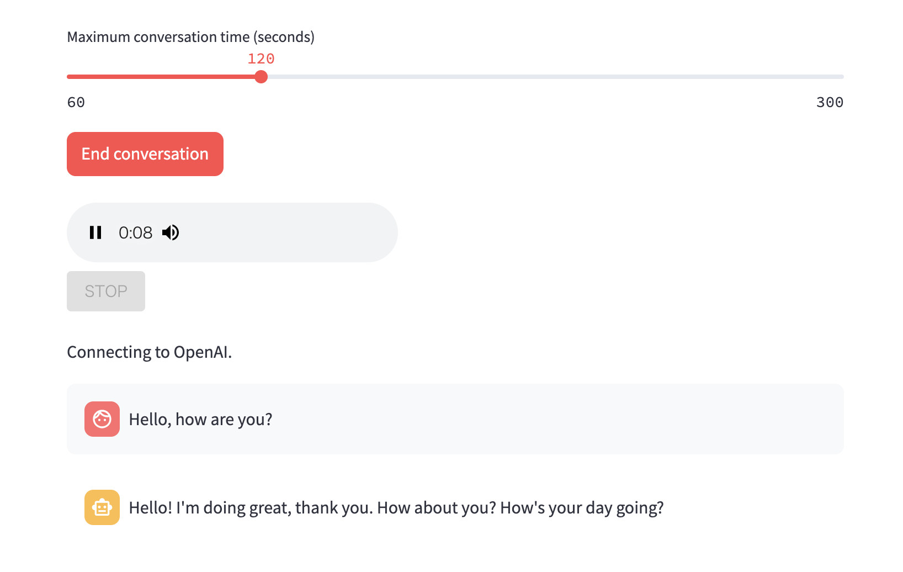

# OpenAI Realtime Voice Chat on Streamlit



## Installation

```sh
uv sync
```

## Configuration

Create `.streamlit/secrets.toml` with:

```toml
OPENAI_API_KEY = "sk-..."
```

## Run

```sh
uv run streamlit run main.py
```

## Article on Qiita (Japanese)

- [OpenAI Realtime API ベースの音声チャットを Streamlit で実装する](https://qiita.com/akeyhero/items/fe5bdd02d9a1cd7782d7)
